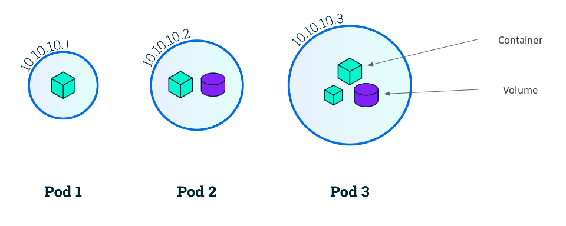

# Recursos de Kubernetes: pod

La unidad más pequeña de kubernetes son los **pod**, con los que podemos correr contenedores. Un **pod** representa un conjunto de contenedores que comparten almacenamiento y una única IP. **Los pod son efímeros**, cuando se destruyen se pierde toda la información que contenía. Si queremos desarrollar aplicaciones persistentes tenemos que utilizar volúmenes.

Por lo tanto, aunque Kubernetes es un orquestador de contenedores, la unidad mínima de ejecución son los pods. 

Si seguimos el principio de *un proceso por contenedor*, nos evitamos tener sistemas (como máquinas virtuales) ejecutando docenas de procesos, pero en determinadas circunstancias necesito más de un proceso para que se ejecute mi servicio. Por lo tanto parece razonable que podamos tener más de un contenedor compartiendo almacenamiento y direccionamiento, que llamamos *Pod*. Además existen mas razones:

* Kubernetes puede trabajar con distintos contenedores (Docker, Rocket, cri-o,...) por lo tanto es necesario añadir una capa de abstracción que maneje las distintas clase de contenedores.
* Además esta capa de abstracción añade información adicional necesaria en Kubernetes como por ejemplo, políticas de reinicio, comprobación de que la aplicación esté inicializada (readiness probe), comprobación de que la aplicación haya realizado alguna acción especificada (liveness probe), ...

