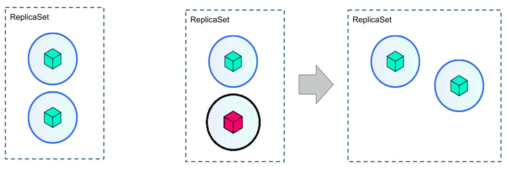

# Recursos de Kubernetes: ReplicaSet

`ReplicaSet` es un recurso de Kubernetes que asegura que siempre se ejecute un número de replicas de un pod determinado. Por lo tanto, nos asegura que un conjunto de pods siempre estñan funcionando y disponibles. Nos proporciona las siguientes características:
  * Que no haya caída del servicio
  * Tolerancia a errores
  * Escabilidad dinámica

## Definición yaml de un ReplicaSet

Vamos a ver un ejemplo de definición de ReplicaSet en el fichero [`nginx-rs.yaml`](ejemplo/nginx/nginx-rs.yaml):

    apiVersion: extensions/v1beta1
    kind: ReplicaSet
    metadata:
      name: nginx
      namespace: default
    spec:
      replicas: 2
      selector:
        matchLabels:
          app: nginx
      template:
        metadata:
          labels:
            app: nginx
        spec:
          containers:
            - image:  nginx
              name:  nginx

* `replicas`: Indicamos el número de pos que siempre se van a estar ejecutando.
* `selector`: Indicamos el pods que vamos a replicar y vamos a controlar con el ReplicaSet. En este caso va a controlar pods que tenga un *label* `app` cuyo valor sea `nginx`.
* `template`: El recurso `ReplicaSet` contiene la definción de un `pod`.

Al crear el `ReplicaSet` se crearán los pods que hemos indicado como número de replicas:

    kubectl create -f nginx-rs.yaml
    replicaset.extensions "nginx" created

Veamos  el `ReplicaSet` creado y los pods que ha levantado.

    kubectl get rs
    NAME      DESIRED   CURRENT   READY     AGE
    nginx     2         2         2         44s

    kubectl get pods
    NAME          READY     STATUS    RESTARTS   AGE
    nginx-5b2rn   1/1       Running   0          1m
    nginx-6kfzg   1/1       Running   0          1m

¿Qué pasaría si borro uno de los pods que se han creado? Inmediatamente se creará uno nuevo para que siempre estén ejecutándose los pods deseados, en este caso 2:

    kubectl delete pod nginx-5b2rn
    pod "nginx-5b2rn" deleted
    
    kubectl get pods
    NAME          READY     STATUS              RESTARTS   AGE
    nginx-6kfzg   1/1       Running             0          2m
    nginx-lkvzj   0/1       ContainerCreating   0          4s
    
    kubectl get pods
    NAME          READY     STATUS    RESTARTS   AGE
    nginx-6kfzg   1/1       Running   0          2m
    nginx-lkvzj   1/1       Running   0          8s

En cualquier momento puedo escalar el número de pods que queremos que se ejecuten:

    kubectl scale rs nginx --replicas=5
    replicaset.extensions "nginx" scaled
    
    kubectl get pods --watch
    NAME          READY     STATUS    RESTARTS   AGE
    nginx-6kfzg   1/1       Running   0          5m
    nginx-bz2gs   1/1       Running   0          46s
    nginx-lkvzj   1/1       Running   0          3m
    nginx-ssblp   1/1       Running   0          46s
    nginx-xxg4j   1/1       Running   0          46s

Como anterior vimos podemos modficar las características de un `ReplicaSet` con la siguiente instrucción:

    kubectl edit rs nginx

Por último si borramos un `ReplicaSet` se borraran todos los pods asociados:

    kubectl delete rs nginx
    replicaset.extensions "nginx" deleted

    kubectl get rs
    No resources found.

    kubectl get pods 
    No resources found.

El uso del recurso `ReplicaSet` sustituye al uso del recurso [`ReplicaController`](https://kubernetes.io/docs/concepts/workloads/controllers/replicationcontroller/), más concretamente el uso de `Deployment` que define un `ReplicaSet`.