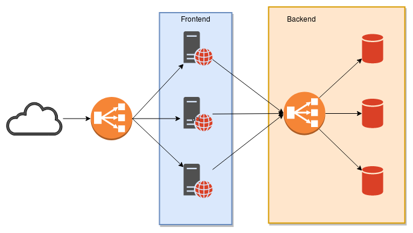

# Desplegando una aplicación en Kubernetes

Un escenario común cuando desplegamos una aplicación web puede ser el siguiente:

En este escenario tenemos los siguientes elementos:

* Un conjunto de máquinas (normalmente virtuales) que sirven la aplicación web (**frontend**).
* Un balanceador de carga externo que reparte el tráfico entre las diferentes máquinas.
* Un número de servidores de bases de datos (**backend**).
* Un balanceador de carga interno que reparte el acceso a las bases de datos.

El escenario anterior se podría montar en Kubernetes de la siguiente forma:

Los distintos recursos de Kubernetes nos proporcionan distintas características muy deseadas:

* `Pods`: La unidad mínima de computación en Kubernetes, permite ejecutar contenedores. Representa un conjunto de contenedores y almacenamiento compartido que comparte una única IP.
* `ReplicaSet`: Recurso de un cluster Kubernetes que asegura que siempre se ejecute un número de replicas de un pod determinado. Nos proporciona las siguientes características:
  * Que no haya caída del servicio
  * Tolerancia a errores
  * Escabilidad dinámica
* `Deployment`: Recurso del cluster Kubernetes que nos permite manejar los `ReplicaSets`. Nos proporciona las siguientes características:
  * Actualizaciones continúas
  * Despliegues automáticos
* `Service`: Nos permite el acceso a los pod. 
* `Ingress`: Nos permite implementar un proxy inverso para el acceso a los distintos servicios establecidos. Estos dos elementos nos proporcionan la siguiente funcionalidad:
  * Balanceo de carga
* Otros recursos de un cluster Kubernetes nos pueden proporcional características adicionales:
  * Migraciones sencillas
  * Monitorización
  * Control de acceso basada en Roles
  * Integración y despliegue continuo

En los siguientes apartados vamos a ir estudiando cada uno de estos recursos.