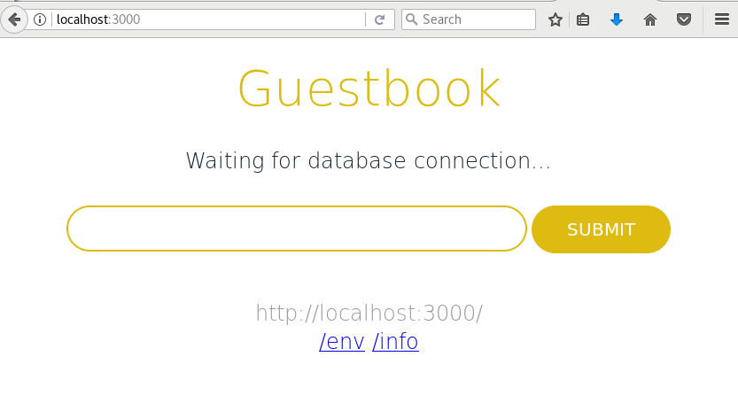

# Ejemplo: Desplegando la aplicación GuestBook (Parte 1)

Vamos a desplegar una aplicación llamada *Guestbook* que trabaja junto a una base de datos *redis*. Por lo tanto vamos a desplegar un **frontend**, nuestra aplicaión y un **backend** la base de datos.

## Despliegue del frontend

Para empezar vamos a crear el `Deployment` de nuestra aplicación que tenemos en el fichero [`frontend-deployment.yaml`](../ejemplos/guestbook/parte1/frontend-deployment.yaml):

    apiVersion: extensions/v1beta1
    kind: Deployment
    metadata:
      name: guestbook
      labels:
        app: guestbook
        tier: frontend
    spec:
      replicas: 3
      template:
        metadata:
          labels:
            app: guestbook
            tier: frontend
        spec:
          containers:
          - name: guestbook
            image: gcr.io/google_containers/guestbook:v3
            ports:
              - name: http-server
                containerPort: 3000

Como vemos se van a generar 3 replicas, la imagen de la aplicación la bajamos del registro de google y se indica el puerto de la aplicación. Para crear el despliegue:

    kubectl create -f frontend-deployment.yaml 
    deployment.extensions "guestbook" created
    
    kubectl get deploy
    NAME        DESIRED   CURRENT   UP-TO-DATE   AVAILABLE   AGE
    guestbook   3         3         3            3           5s
    
    kubectl get rs
    NAME                  DESIRED   CURRENT   READY     AGE
    guestbook-bb55b9bcf   3         3         3         5s
    
    kubectl get pods
    NAME                        READY     STATUS    RESTARTS   AGE
    guestbook-bb55b9bcf-2dn8t   1/1       Running   0          5s
    guestbook-bb55b9bcf-5t5wg   1/1       Running   0          5s
    guestbook-bb55b9bcf-lbvb8   1/1       Running   0          5s

## Despliegue del backend

En este caso vamos a realizar dos despliegues: uno con una base de datos *redis* como *master* y otra con *redis* como esclavo.

El `Deployment` del master de redis, lo encontramos en el fichero [`redis-master-deployment.yaml`](../ejemplos/guestbook/parte1/redis-master-deployment.yaml):

    apiVersion: extensions/v1beta1
    kind: Deployment
    metadata:
      name: redis-master
      labels:
        app: redis
        role: master
        tier: backend
    spec:
      replicas: 1
      template:
        metadata:
          labels:
            app: redis
            role: master
            tier: backend
        spec:
          containers:
            - name: master
              image: redis
              ports:
                - name: redis-server
                  containerPort: 6379
              env:
                - name: ALLOW_EMPTY_PASSWORD
                  value: "yes"
                - name: REDIS_REPLICATION_MODE
                  value: master

Comprobamos como se ha configurado el contendor por medio de variables de entorno (sección `env`). Creamos el despliegue:

    kubectl create -f redis-master-deployment.yaml 
    deployment.extensions "redis-master" created

Y de la misma manera desplegamos el redis slave, que encontramos en el fichero [`redis-slave-deployment.yaml`](../ejemplos/guestbook/parte1/redis-slave-deployment.yaml):

    apiVersion: extensions/v1beta1
    kind: Deployment
    metadata:
      name: redis-slave
      labels:
        app: redis
        role: slave
        tier: backend
    spec:
      replicas: 3
      template:
        metadata:
          labels:
            app: redis
            role: slave
            tier: backend
        spec:
          containers:
            - name: slave
              image: redis
              ports:
                - name: redis-server
                  containerPort: 6379
              env:
                - name: ALLOW_EMPTY_PASSWORD
                  value: "yes"
                - name: REDIS_REPLICATION_MODE
                  value: slave
                - name: REDIS_MASTER_HOST
                  value: redis-master
                - name: REDIS_MASTER_PORT_NUMBER
                  value: "6379"

En este caso se van a levantar 3 replicas.

    kubectl create -f redis-slave-deployment.yaml 
    deployment.extensions "redis-slave" created

Finalmente comprobamos los recurso que se han creado:

    kubectl get deploy
    NAME           DESIRED   CURRENT   UP-TO-DATE   AVAILABLE   AGE
    guestbook      3         3         3            3           6m
    redis-master   1         1         1            1           10 m
    redis-slave    3         3         3            3           10 m
    
    kubectl get rs
    NAME                     DESIRED   CURRENT   READY     AGE
    guestbook-bb55b9bcf      3         3         3         6m
    redis-master-574b47699   1         1         1         10 m
    redis-slave-7cfb9d5fc6   3         3         3         10 m
    
    kubectl get pods
    NAME                           READY     STATUS    RESTARTS   AGE
    guestbook-bb55b9bcf-2dn8t      1/1       Running   0          6m
    guestbook-bb55b9bcf-5t5wg      1/1       Running   0          6m
    guestbook-bb55b9bcf-lbvb8      1/1       Running   0          6m
    redis-master-574b47699-rn9gf   1/1       Running   0          10 m
    redis-slave-7cfb9d5fc6-92q6n   1/1       Running   0          10 m
    redis-slave-7cfb9d5fc6-d4t42   1/1       Running   0          10 m
    redis-slave-7cfb9d5fc6-qkmp4   1/1       Running   0          10 m

## Acceso a la aplicación

Accedemos a la aplicación redirigiendo los puertos:

    kubectl port-forward deployment/guestbook 3000:3000

Y accedemos a la aplicación:

Como podemos ver la aplicación no funciona porque está esperando a conectarse a la base de datos, es decir, nuestra aplicación no puede conectar a la base de datos (no la encuentra). Para solucionar este problema vamos a introducir un nuevo recurso de Kubernetes: los servicios ([`services`](https://kubernetes.io/docs/concepts/services-networking/service/)) que permiten configurar el acceso a los pods.
