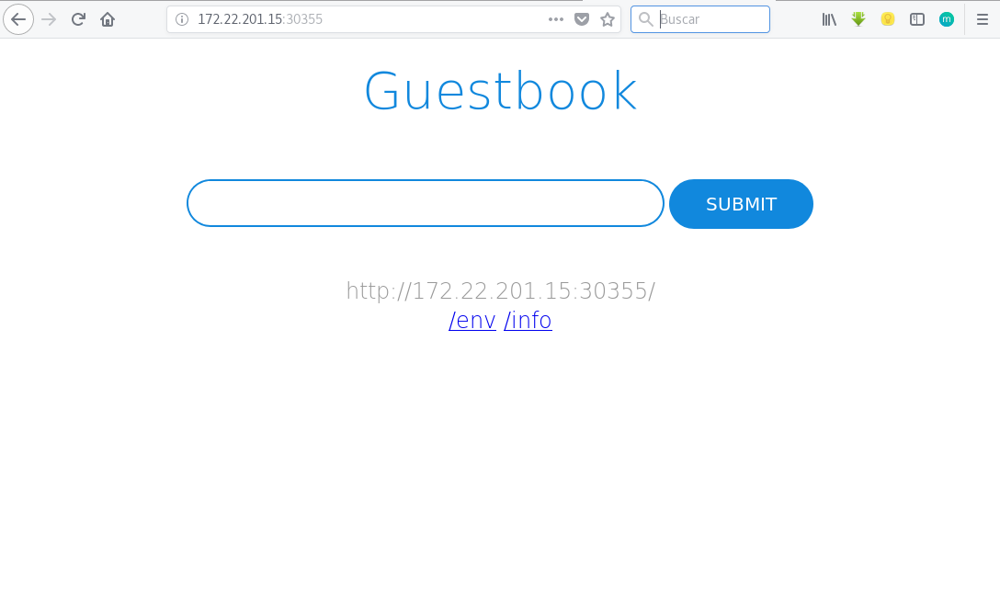

# Ejemplo: Desplegando la aplicación GuestBook (Parte 2)

Nuestra aplicación `guestbook` nos daba un error porque no podía acceder a la base de datos redis, además la forma que teníamos para acceder a la aplicación era utilizando la redirección de puerto usando la instrucción `kubectl port-forward`.

En este ejemplo vamos a crear dos servicios.

## Definición del  servicio para poder acceder a la base de datos redis

En este caso no tenemos que acceder a la base de datos desde el exterior. Es la aplicación la que internamente debe poder acceder a ella, por tanto vamos a crear un servicio del tipo *ClusterIP*. En el fichero [`redis-master-srv.yaml`](https://github.com/josedom24/kubernetes/blob/master/ejemplos/guestbook/parte2/redis-master-srv.yaml) encontramos la definición del servicio para acceder al *master* de *redis*:

    apiVersion: v1
    kind: Service
    metadata:
      name: redis-master
      labels:
        app: redis
        role: master
        tier: backend
    spec:
      ports:
      - port: 6379
        targetPort: redis-server
      selector:
        app: redis
        role: master
        tier: backend
      type: ClusterIP

De forma similar el fichero [`redis-slave-srv.yaml`](https://github.com/josedom24/kubernetes/blob/master/ejemplos/guestbook/parte2/redis-slave-srv.yaml) define el servicio apra acceder al *slave* de *redis*.

## Definición del  servicio para poder acceder a la aplicación

En el fichero [`frontend-srv.yaml`](https://github.com/josedom24/kubernetes/blob/master/ejemplos/guestbook/parte2/frontend-srv.yaml) encontramos la definición del servicio, que en este caso será del tipo *NodePort* para poder acceder a la aplicación desde el exterior:

    apiVersion: v1
    kind: Service
    metadata:
      name: frontend
      labels:
        app: guestbook
        tier: frontend
    spec:
      type: NodePort
      ports:
      - port: 80
        targetPort: http-server
      selector:
        app: guestbook
        tier: frontend

## Creando los servicios

Vamos a crear primero los servicios para el acceso a la base de datos:

    kubectl create -f redis-master-srv.yaml 
    service "redis-master" created
    
    kubectl create -f redis-slave-srv.yaml 
    service "redis-slave" created

Y a continuación creamos el servicio para el acceso a la aplicación:

    kubectl create -f frontend-srv.yaml 
    service "frontend" created

Y comprobamos que hemos creado dos servicio del tipo *ClustrIP* para el acceso a la base de datos, y uno del tipo *NodePort* para el acceso a la aplicación:

    kubectl get services
    NAME           TYPE        CLUSTER-IP       EXTERNAL-IP   PORT(S)          AGE
    frontend       NodePort    10.103.199.174   <none>        80:30355/TCP     15s
    kubernetes     ClusterIP   10.96.0.1        <none>        443/TCP          7d
    redis-master   ClusterIP   10.108.176.214   <none>        6379/TCP         1m
    redis-slave    ClusterIP   10.105.89.203    <none>        6379/TCP         1m

Además comprobamos que nos han asignado el puerto 30355 para el acceso a la aplicación:

