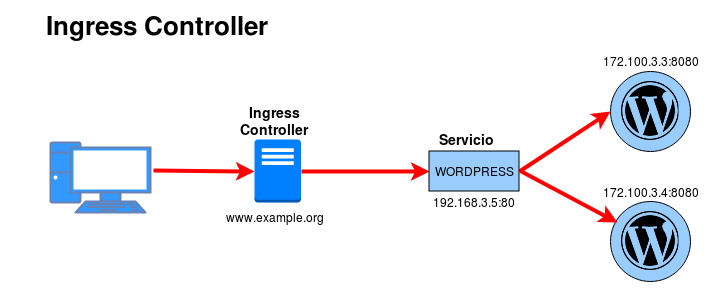
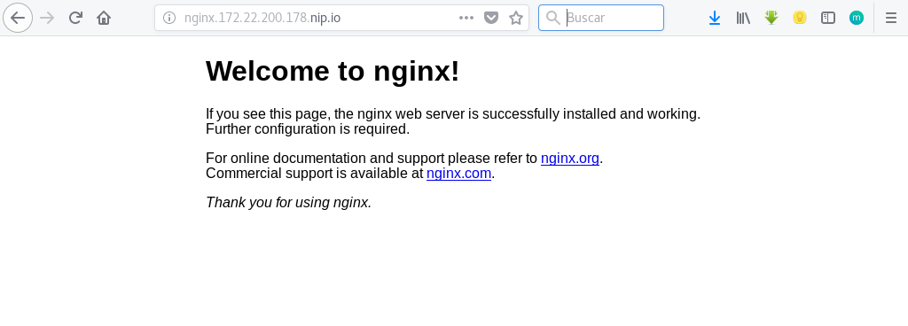

# Recursos de Kubernetes: Ingress

Hasta ahora tenemos dos opciones principales para acceder a nuestras aplicaciones desde el exterior:

1. Utilizando servicios del tipo *NodePort*: Esta opción no es muy viable para entornos de producción ya que tenemos que utilizar puertos aleatorios desde 30000-40000.
2. Utilizando servicios del tipo *LoadBalancer*: Esta opción sólo es válida si trabajamos en un proveedor Cloud que nos cree un balanceador de carga para cada una de las aplicaciones, en cloud público puede ser una opción muy cara.

La solución puede ser utilizar un [`Ingress controller`](https://kubernetes.io/docs/concepts/services-networking/ingress/) que nos permite utilizar un proxy inverso (HAprozy, nginx, traefik,...) que por medio de reglas de encaminamiento que obtiene de la API de Kubernetes nos permite el acceso a nuestras aplicaciones por medio de nombres.

* Vamos a desplegar una pod que implementa un proxy inverso (podemos utilizar varias opciones: nginx, HAproxy, traefik,...) que esperara peticiones HTTP y HTTPS.
* Por lo tanto el `Ingress Controller` será el nodo del cluster donde se ha instalado el pod. En nuestro caso, para realizar el despliegue vamos utilizar un recurso de Kubernetes llamado [`DaemontSet`](https://kubernetes.io/docs/concepts/workloads/controllers/daemonset/) que asegura que el despliegue se hace en todos los nodos del cluster y que los puertos que expone los pods (80 y 443) están mapeado y son accesible en los nodos. Por lo que cada uno de los nodos del cluster va a poseer una copia del `Ingress Controller`.
* No es necesario que al servicio al que accede el `Ingress Controller` este configurado del tipo *NodePort*.

## Instalación de Ingress Controller en Kubeadm con Traefik

Siguiendo los pasos que obtenemos en la guía de usuario de [`traefik`](https://docs.traefik.io/user-guide/kubernetes/) vamos a realizar la instalación del ingress controller.

Lo primero es crear las reglas de aceso (RBAC) necesarias (puedes ver el contenido del los ficheros yaml en la documentación):

    kubectl apply -f https://raw.githubusercontent.com/containous/traefik/master/examples/k8s/traefik-rbac.yaml

Como hemos comentado podemos desplegar el proxy utilizando un `Deployment` o un `DaemonSet`, hemos elegido esta última opción como indicabamos anteriormente:

    kubectl apply -f https://raw.githubusercontent.com/containous/traefik/master/examples/k8s/traefik-ds.yaml

Comprobamos el despliegue:

    kubectl get ds -n kube-system
    NAME                         DESIRED   CURRENT   READY     UP-TO-DATE   AVAILABLE   NODE SELECTOR                     AGE
    ...
    traefik-ingress-controller   2         2         2         2            2           <none>                            4h

Comprobamos la creación de los pods:

    kubectl get pods -n kube-system -o wide
    NAME                                       READY     STATUS    RESTARTS   AGE       IP                NODE
    ...
    traefik-ingress-controller-rdvh7           1/1       Running   0          4h        10.0.0.3          k8s-3
    traefik-ingress-controller-vqngg           1/1       Running   0          4h        10.0.0.7          k8s-2.novalocal

Como vemos se ha creado un pod en cada nodo.

La IP de acceso a uno de los nodos en la 172.22.200.178, por lo que podemos hacer la prueba de que el proxy inverso está funcionando:

    curl http://172.22.200.178
    404 page not found

## Configurando el recurso Ingress

Partimos de que tenemos desplegado un servidor web nginx, como se puede observar el servicio que se ha creado es de tipo *ClusterIP*:

    kubectl get deploy,service,pods
    NAME                                 DESIRED   CURRENT   UP-TO-DATE   AVAILABLE   AGE
    deployment.extensions/nginx          2         2         2            2           25s

    NAME                   TYPE        CLUSTER-IP       EXTERNAL-IP   PORT(S)          AGE
    service/nginx          ClusterIP   10.107.232.75    <none>        80/TCP           25s

    NAME                               READY     STATUS    RESTARTS   AGE
    pod/nginx-6f596bfb6d-49h9d         1/1       Running   0          25s
    pod/nginx-6f596bfb6d-swclf         1/1       Running   0          25s

A continuación vamos a crear la definición del recurso Ingress en el fichero [`nginx-ingress.yaml`]():

    apiVersion: extensions/v1beta1
    kind: Ingress
    metadata:
      name: nginx
    spec:
      rules:
      - host: nginx.172.22.200.178.nip.io
        http:
          paths:
          - path: /
            backend:
              serviceName: nginx
              servicePort: 80

En este caso hemos creado una regla: cuando accedemos con el nombre `nginx.172.22.200.178.nip.io` (más infomación del dominio [`nip.io`](http://nip.io/)) a la ruta `/`, accederemos al servicio llamado `nginx` en el puerto 80.

    kubectl create -f nginx-ingress.yaml 
    ingress.extensions "nginx" created

    kubectl get ingress
    NAME      HOSTS                         ADDRESS   PORTS     AGE
    nginx     nginx.172.22.200.178.nip.io             80        10s

Y accedemos desde el navegador:

Además podemos acceder al *dashboard* de traefik en el puerto 8080, donde podemos ver de forma gráfica las distintas reglas definidas en el proxy y otras informaciones interesantes:

