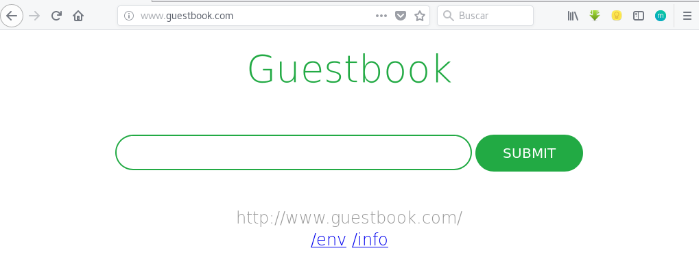
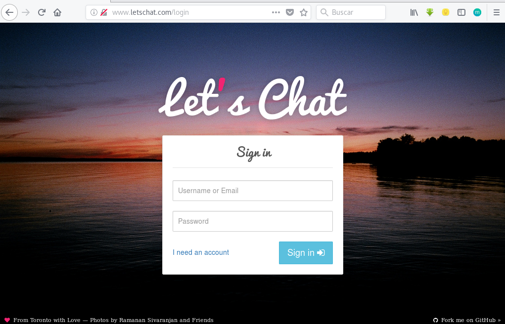

# Ejemplo: Accediendo a nuestras aplicaciones con Ingress

Partimos del escenario donde tenemos desplegado nuestras dos aplicaciones con las que hemos estado trabajando en prácticas anteriores: guestbook y letschat.

    kubectl get deploy,services
    NAME                                 DESIRED   CURRENT   UP-TO-DATE   AVAILABLE   AGE
    deployment.extensions/guestbook      3         3         3            3           1d
    deployment.extensions/letschat       3         3         3            3           1d
    deployment.extensions/mongo          1         1         1            1           1d
    deployment.extensions/nginx          4         4         4            4           21h
    deployment.extensions/redis-master   1         1         1            1           1d
    deployment.extensions/redis-slave    3         3         3            3           1d

    NAME                   TYPE        CLUSTER-IP       EXTERNAL-IP   PORT(S)          AGE
    service/frontend       ClusterIP   10.104.59.122    <none>        80/TCP           1d
    service/kubernetes     ClusterIP   10.96.0.1        <none>        443/TCP          1d
    service/letschat       ClusterIP   10.111.18.129    <none>        8080/TCP         1d
    service/mongo          ClusterIP   10.104.219.60    <none>        27017/TCP        1d
    service/nginx          ClusterIP   10.107.232.75    <none>        80/TCP           21h
    service/redis-master   ClusterIP   10.98.46.85      <none>        6379/TCP         1d
    service/redis-slave    ClusterIP   10.110.200.207   <none>        6379/TCP         1d

Como podemos ver los servicios que dan acceso a las aplicaciones lo hemos creado del tipo *ClustrIP* por lo que ahora mismo no tenemos forma de acceder a ellos desde el exterior. Vamos a crear un recurso Ingress para acceder de ello por medio de dos nombres, para ello lo definimos en el fichero [`ingress.yaml`](https://github.com/josedom24/kubernetes/blob/master/ejemplos/ingress/ingress.yaml):

    apiVersion: extensions/v1beta1
    kind: Ingress
    metadata:
      name: ingress-name-based
      annotations:
        traefik.ingress.kubernetes.io/affinity: "true"
    spec:
      rules:
      - host: www.guestbook.com
        http:
          paths:
          - path: "/"
            backend:
              serviceName: frontend
              servicePort: 80
      - host: www.letschat.com
        http:
          paths:
          - path: "/"
            backend:
              serviceName: letschat
              servicePort: 8080

* Como vemos en un fichero podemos definir varías reglas de encaminamiento.
* Podemos configurar el proxy inverso utilizando *Annotations*, en este caso `traefik.ingress.kubernetes.io/affinity` nos permite activa la persistencia en las sesiones. Para ver más opciones de configuración en traefik puedes ver la [documentación oficial](https://docs.traefik.io/configuration/backends/kubernetes/#annotations).

Creamos el recurso ingress:

    kubectl create -f ingress.yaml 
    ingress.extensions "ingress-name-based" created

    kubectl get ingress
    NAME                 HOSTS                                ADDRESS   PORTS     AGE
    ingress-name-based   www.guestbook.com,www.letschat.com             80        15s

Vamos a utilizar resolución estática, por lo tanto añado la siguiente línea al fichero `/etc/hosts`:

    172.22.200.178  www.guestbook.com  www.letschat.com

Y ya podemos acceder:

## Para seguir investigando

* Las distintas aplicaciones que podemos usar para crear un `Ingress Controller` ([HAproxy](https://www.haproxy.com/blog/haproxy_ingress_controller_for_kubernetes/), [nginx](https://www.nginx.com/products/nginx/kubernetes-ingress-controller/), [traefik](https://docs.traefik.io/user-guide/kubernetes/),...) nos dan diferentes opciones de configuración.
* Traefik también ofrece la posibilidad de usar [rutas basadas en path](https://docs.traefik.io/user-guide/kubernetes/#path-based-routing), trabajar con [certificados TLS](https://docs.traefik.io/user-guide/kubernetes/#add-a-tls-certificate-to-the-ingress), [autentificación básica](https://docs.traefik.io/user-guide/kubernetes/#basic-authentication), ...
* Otra opción para acceder al `Ingress controller` es desplegarlo con un `Deployment` y crear un servicio del tipo *LoadBalancer* para acceder a él, en este caso es muy fácil escalarlo.
