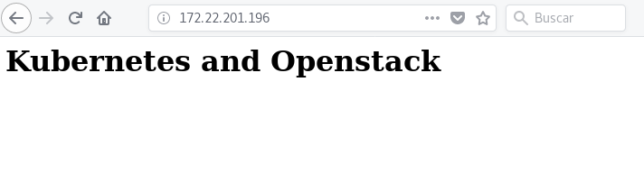

# Integración de Kubernetes con OpenStack

Vamos a realizar una instalación de Kubernetes y los vamos a configurar para que utilice los recursos ofrecidos por OpenStack: en concreto, vamos a poder crear de forma dinámica volúmenes (*PersistentVolumen*) ofrecidos por el componente de OpenStack encargado de la gestión de volúmenes: **Cinder**, y vamos a poder crear *Services* del tipo *LoadBalancer* creando un balanceador en el componente de redes de OpenStack: **Neutron**.

Tenemos dos opciones de configuración para conseguir comunicarnos con un proveedor de cloud:

* Configurar el componente [Kube Controller Manager](https://kubernetes.io/docs/reference/command-line-tools-reference/kube-controller-manager/), que entre otras funciones, se encargará de conectar con el proveedor cloud (en nuestro caso OpenStack).
* Desde la versión 1.6 de Kubernetes se ha introducido un nuevo componente [Cloud Controller Manager](https://kubernetes.io/docs/tasks/administer-cluster/running-cloud-controller/) que específicamente es el encargado de gestionar el proveedor cloud, de tal manera que la arquitectura de componentes de Kuberentes se hace más modular.

En esta unidad vamos a configurar el *Kube Controller Manager* para comunicarse con OpenSatck. Para la segunda opción utilizando *Cloud Controller Manager* para comunicarse con OpenStack puede ser muy interesante el repositorio de [`openstack-cloud-controller-manager`](https://github.com/dims/openstack-cloud-controller-manager).

## Integración de Kubernetes y OpenStack con Kubeadm

Vamos a partir de una instalación de kubernetes con kubeadm (puedes seguir el apartado [Instalación de kubernetes con kubeadm](kubeadm.md)). En esta instalación he usado el plugin CNI `wave`:

    sysctl net.bridge.bridge-nf-call-iptables=1
    kubectl apply -f "https://cloud.weave.works/k8s/net?k8s-version=$(kubectl version | base64 | tr -d '\n')"

> Si necesitas reinstalar kubeadm debes ejecutar `kubeadm reset` en todos los nodos del cluster.

## Configuración del acceso a OpenStack

Lo primero, vamos a crear un fichero `cloud.conf` donde vamos a guardar las credenciales de acceso a OpenStack y los recursos que vamos a utilizar:

    [Global]
    auth-url=https://<openstack_endpoint>:5000/v3
    domain-name=Nombre del dominio
    tenant-name=Nombre del proyecto
    username=usuario
    password=contraseña
    ca-file=/etc/kubernetes/ca.crt

    [LoadBalancer]
    subnet-id=bf7be908-51a4-45d1-8403-391cfe1a73aa
    floating-network-id=49812d85-8e7a-4c31-baa2-d427692f6568

Se pueden configurar más opciones que puedes encontrar en este [enlace](https://kubernetes.io/docs/concepts/cluster-administration/cloud-providers/#cloud-conf).

En mi caso el acceso a OpenStack se hace de forma cifrada (con https) por lo que necesito el certificado de la Autoridad Certificadora. Los ficheros `cloud.conf` y `ca.crt` los guardo en el directorio `/etc/kubernetes` del master y los nodos del cluster.

## Configurando kube-controller-manager

Tenemos que modificar la configuración del pod `kube-controller-manager` indicado el proveedor cloud que vamos autilizar y el fichero de configuración que debe utilizar (`cloud.conf`). Además debemos asegurarnos que el pod tiene acceso al fichero de configuración `cloud.conf` y al certificado de la CA. 
Para realizar la configuración debemos modificar el fichero `/etc/kubernetes/manifests/kube-controller-manager.yaml` en el nodo master de la siguiente forma:

<pre>
... 
spec:
  containers:
  - command:
    - kube-controller-manager
    ...
    <strong>- --cloud-provider=openstack</strong>
    <strong>- --cloud-config=/etc/kubernetes/cloud.conf</strong>
...
    volumeMounts:
    ...
    <strong>- mountPath: /etc/kubernetes/cloud.conf
      name: cloud-config
      readOnly: true 
    - mountPath: /etc/kubernetes/ca.crt
      name: cloud-ca
      readOnly: true</strong>
...
volumes:
  ...
  <strong>- hostPath:
      path: /etc/kubernetes/cloud.conf
      type: FileOrCreate
    name: cloud-config
  - hostPath:
      path: /etc/kubernetes/ca.crt
      type: FileOrCreate
    name: cloud-ca</strong>
</pre>

Una vez modificado correctamente el fichero, el pod `kube-controller-manager` se reiniciará con la nueva configuración, podemos comprobar que la modificación ha sido realizada con la siguiente instrucción:

    kubectl describe pod kube-controller-manager -n kube-system | grep '/etc/kubernetes/cloud.conf'

          --cloud-config=/etc/kubernetes/cloud.conf
          /etc/kubernetes/cloud.conf from cloud-config (ro)
        Path:          /etc/kubernetes/cloud.conf

## Configurando kubelet

A continuación debemos **reiniciar el componente `kubelet` en el master y en los nodos del cluster** modificando su configuración para indicarles el proveedor cloud que vamos a utilizar y el fichero de configuración que debe utilizar (`cloud.conf`). Para ello modificamos el fichero `/etc/systemd/system/kubelet.service.d/10-kubeadm.conf` añadiendo la siguiente línea:

    Environment="KUBELET_EXTRA_ARGS=--cloud-provider=openstack --cloud-config=/etc/kubernetes/cloud.conf"

Y reiniciamos el servicio:

    systemctl daemon-reload
    systemctl restart kubelet

Y comprobamos que el servicio está ejecutándose:

    ps xau | grep /usr/bin/kubelet

    root      5323 14.0  3.6 354508 74652 ?        Ssl  17:52   0:01 /usr/bin/kubelet --bootstrap-kubeconfig=/etc/kubernetes/bootstrap-kubelet.conf --kubeconfig=/etc/kubernetes/kubelet.conf --pod-manifest-path=/etc/kubernetes/manifests --allow-privileged=true --network-plugin=cni --cni-conf-dir=/etc/cni/net.d --cni-bin-dir=/opt/cni/bin --cluster-dns=10.96.0.10 --cluster-domain=cluster.local --authorization-mode=Webhook --client-ca-file=/etc/kubernetes/pki/ca.crt --cadvisor-port=0 --rotate-certificates=true --cert-dir=/var/lib/kubelet/pki --cloud-provider=openstack --cloud-config=/etc/kubernetes/cloud.conf

## Probando la creación dinámica volúmenes por Cinder

Lo primero es crear un recurso del tipo [`StorageClass`](https://kubernetes.io/docs/concepts/storage/storage-classes/) Que nos permite configurar un origen o clase de almacenamiento disponible en el cluster. Para ello creamos el fichero `cinder-sc.yaml`:

    apiVersion: storage.k8s.io/v1beta1
    kind: StorageClass
    metadata:
      name: standard
      annotations:
        storageclass.beta.kubernetes.io/is-default-class: "true"
      labels:
        kubernetes.io/cluster-service: "true"
        addonmanager.kubernetes.io/mode: EnsureExists
    provisioner: kubernetes.io/cinder

Y creamos el recurso:

    kubectl create -f cinder-sc.yaml 
    storageclass.storage.k8s.io "standard" created

    kubectl get sc
    NAME                 PROVISIONER            AGE
    standard (default)   kubernetes.io/cinder   40s

A continuación vamos a crear un recurso `PersistentVolumeClaim` con el fichero `demo-cinder-pvc.yaml`:

    kind: PersistentVolumeClaim
    apiVersion: v1
    metadata:
      name: cinder-claim
      annotations:
        volume.beta.kubernetes.io/storage-class: "standard"
    spec:
      accessModes:
      - ReadWriteOnce
      resources:
        requests:
          storage: 1Gi

Y lo creamos:

    kubectl create -f demo-cinder-pvc.yaml 
    persistentvolumeclaim "cinder-claim" created

Y podemos comprobar como de forma dinámica se ha creado un recurso `PersistentVolumen`:

    kubectl get pv,pvc
    
    NAME                                                        CAPACITY   ACCESS MODES   RECLAIM POLICY    STATUS    CLAIM                  STORAGECLASS   REASON    AGE
    persistentvolume/pvc-569773b8-682a-11e8-931d-fa163e99cb75   1Gi        RWO            Delete           Bound        default/cinder-claim   standard                 19s

    NAME                                 STATUS    VOLUME                                     CAPACITY   ACCESS     MODES   STORAGECLASS   AGE
    persistentvolumeclaim/cinder-claim   Bound     pvc-569773b8-682a-11e8-931d-fa163e99cb75   1Gi        RWO            standard       19s

Como podemos comprobar al crear un volumen en Kubernetes desde Cinder el modo de acceso es RWO: Escritura y lectura para un sólo nodo.

Además podemos comprobar como realmente se ha creado un volumen en OpenStack:

    openstack volume list                   
    +--------------------------------------+-------------------------------------------------------------+-----------+------+-------------+
    | ID                                   | Name                                                        | Status    |  Size |Attached to |
    +--------------------------------------+-------------------------------------------------------------+-----------+------+-------------+
    | e952c9c8-b423-451f-b6a0-32521e0a6fe6 | kubernetes-dynamic-pvc-569773b8-682a-11e8-931d-fa163e99cb75 | in-use    |    1 | available   | 
    +--------------------------------------+-------------------------------------------------------------+-----------+------+-------------+

## Utilizando el volumen en un despliegue

A continuación vamos a crear un deployment que cree un servidor nginx cuyo `DocumentRoot` va a estar montado en el volumen que hemos creado, para ello creamos el fichero `nginx-deployment.yaml`:

    apiVersion: extensions/v1beta1
    kind: Deployment
    metadata:
      name: nginx
      namespace: default
      labels:
        app: nginx
    spec:
      replicas: 1
      template:
        metadata:
          labels:
            app: nginx
        spec:
          containers:
          - image: nginx
            name: nginx
            volumeMounts:
              - mountPath: /usr/share/nginx/html
                name: vol
            ports:
            - name: http
              containerPort: 80
          volumes:
            - name: vol
              persistentVolumeClaim:
                claimName: cinder-claim

Creamos el deployment y comprobamos que el volumen de OpenStack se ha conectado con el nodo donde se ha creado el pod:

    openstack volume list      
    
    +--------------------------------------+-------------------------------------------------------------+--------+------+--------------------------------+
    | ID                                   | Name                                                        |  Status| Size | Attached to                    |
    +--------------------------------------+-------------------------------------------------------------+--------+------+--------------------------------+
    | e952c9c8-b423-451f-b6a0-32521e0a6fe6 | kubernetes-dynamic-pvc-569773b8-682a-11e8-931d-fa163e99cb75 |  in-use|    1 | Attached to k8s-3 on /dev/vdb  |
    +--------------------------------------+-------------------------------------------------------------+--------+------+--------------------------------+

Evidentemente el volumen que acabamos de crear está vacío, por lo tanto vamos a crear un fichero `index.html`:

    kubectl exec -it nginx-695ffcfd59-js75s -- bash -c "echo '<h1>Kubernetes and Openstack</h1>'>/usr/share/nginx/html/index.html"

## Uso de servicio tipo LoadBalancer

Ya hemos comprobado como podemos crear de forma dínamica volúmenes en cinder desde Kubernetes, en este apartado vamos a crear un servicio de tipo *LoadBalancer*, que va a crear en el comoponente `neutron` de OpenStack un balanceador de carga con una IP flotente asignada que nos permiteirá acceder al servidor nginx. Para ello creamos un fichero `nginx-srv.yaml` de la siguiente forma:

    apiVersion: v1
    kind: Service
    metadata:
      name: nginx
      namespace: default
    spec:
      type: LoadBalancer
      ports:
      - name: http
        port: 80
        targetPort: http
      selector:
        app: nginx

Creamos el servicio, y al cabo de unos segundos comprobamos la IP flotante asignada al balanceador de carga de OpenStack:

    kubectl create -f nginx-srv.yaml
    service "nginx" created

    kubectl get services
    NAME         TYPE           CLUSTER-IP    EXTERNAL-IP      PORT(S)        AGE
    ...
    nginx        LoadBalancer   10.98.19.43   172.22.201.196   80:32415/TCP   18s

Podemos comprobar en OpenStack que le balanceador se ha creado:

    neutron lbaas-loadbalancer-list                                                                                               

    +--------------------------------------+----------------------------------+-------------+---------------------+----------+
    | id                                   | name                             | vip_address | provisioning_status | provider |
    +--------------------------------------+----------------------------------+-------------+---------------------+----------+
    | 6b4d7557-4762-4d77-bdb4-b26f77b4d471 | a56a875a9683111e8931dfa163e99cb7 | 10.0.0.8    | ACTIVE              | haproxy  |
    +--------------------------------------+----------------------------------+-------------+---------------------+----------+

Y comprobamos la ip flotante asignada:

    openstack floating ip list

    +--------------------------------------+---------------------+------------------+--------------------------------------+--------------------------------------  +----------------------------------+
    | ID                                   | Floating IP Address | Fixed IP Address | Port                                 | Floating Network                     |     Project                          |
    +--------------------------------------+---------------------+------------------+--------------------------------------+--------------------------------------  +----------------------------------+
    ...
    | b0cfa51e-2cf8-40bf-9e8e-d37430883889 | 172.22.201.196      | 10.0.0.8         | 17c66af7-8783-45a4-8d69-e1cf7723894f | 49812d85-8e7a-4c31-baa2-d427692f6568 |     d8799b3f93124dd7b79cde85730dff6d |
    ...

Por último podemos acceder al servidor web utilizando la IP flotante del balanceador que hemos creado:

