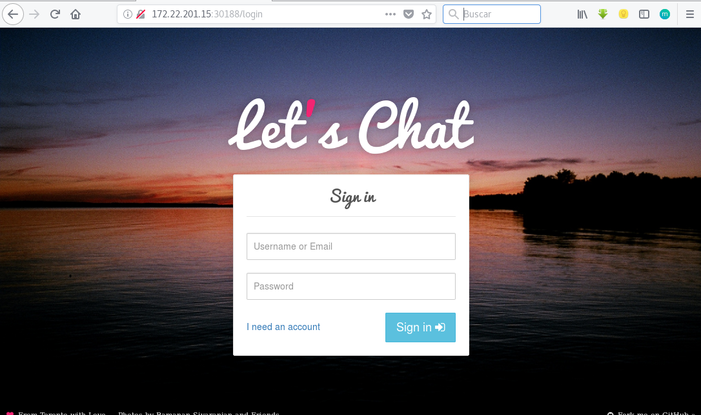

# Ejemplo: Desplegando la aplicación LetsChat

En este ejemplo vamos a instalar una aplicación web (CMS), llamado letscahat, que está escrito en node.js y utiliza una base de datos mongo. Por lo tanto vamos a crear dos deployments:

* Uno con la aplicación letschat, este deployment lo vamos poder escalar sin problemas.
* Otro con la base de datos mongo.

En el directorio [`letschat`](https://github.com/josedom24/kubernetes/tree/master/ejemplos/letschat) tenemos los ficheros yaml que describen los dos despliegues, además de los que describen los dos servicios:

* El fichero `mongo-srv.yaml` crea un servicio del tipo *ClustrIP* para poder acceder a mongo:

        apiVersion: v1
        kind: Service
        metadata:
          name: mongo
        spec:
          ports:
          - name: mongo
            port: 27017
            targetPort: mongo
          selector:
            name: mongo

* El fichero `letschat-srv.yaml` crea el servicio *NodePort* Para poder acceder desde el exterior a la aplicación:

        apiVersion: v1
        kind: Service
        metadata:
        name: letschat
        spec:
        type: NodePort
        ports:
        - name: http
            port: 8080
            targetPort: http-server
        selector:
            name: letschat

Si queremos desplegar todos los ficheros que hay en el directorio lo podemos hacer de la siguiente forma:

    kubectl create -f letschat/
    deployment.extensions "letschat" created
    service "letschat" created
    deployment.extensions "mongo" created
    service "mongo" created
    
    kubectl get deploy,rs,service,pods
    NAME                             DESIRED   CURRENT   UP-TO-DATE   AVAILABLE   AGE
    deployment.extensions/letschat   3         3         3            3           15s
    deployment.extensions/mongo      1         1         1            1           15s

    NAME                                        DESIRED   CURRENT   READY     AGE
    replicaset.extensions/letschat-57cb7f589f   3         3         3         15s
    replicaset.extensions/mongo-769fdf6975      1         1         1         15s

    NAME                 TYPE        CLUSTER-IP       EXTERNAL-IP   PORT(S)          AGE
    service/kubernetes   ClusterIP   10.96.0.1        <none>        443/TCP          6d
    service/letschat     NodePort    10.100.157.57    <none>        8080:30188/TCP   15s
    service/mongo        ClusterIP   10.97.213.5      <none>        27017/TCP        15s

    NAME                            READY     STATUS    RESTARTS   AGE
    pod/letschat-57cb7f589f-czl8d   1/1       Running   0          15s
    pod/letschat-57cb7f589f-jfnwb   1/1       Running   0          15s
    pod/letschat-57cb7f589f-zzwnv   1/1       Running   0          15s
    pod/mongo-769fdf6975-nlt4r      1/1       Running   0          15s

Y vemos como podemos acceder a la aplicación:

