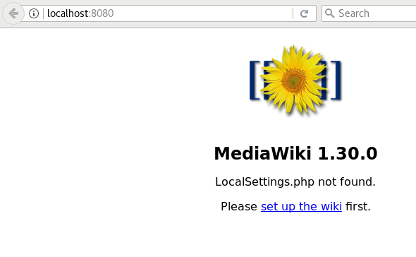

# Ejemplo: Desplegando la aplicación Mediawiki

[`mediawiki`](https://www.mediawiki.org/wiki/MediaWiki) es una aplicación escrita en PHP que nos permite gestionar una wiki. Vamos a hacer un despliegue en nuestro cluster de kubernetes.

En este ejemplo vamos a crear el `Deployment` sin utilizar su definición en Yaml, con la siguiente instrucción:

    kubectl run mediawiki --image=mediawiki --record
    deployment.apps "mediawiki" created
    
    kubectl get deploy
    NAME        DESIRED   CURRENT   UP-TO-DATE   AVAILABLE   AGE
    mediawiki   1         1         1            0           5s
    
    kubectl get rs
    NAME                   DESIRED   CURRENT   READY     AGE
    mediawiki-85bf9d6bd7   1         1         0         5s

    kubectl get pods
    NAME                         READY     STATUS    RESTARTS   AGE
    mediawiki-85bf9d6bd7-97bhg   1/1       Running   0          25s

Utilizando la instrucción `kubectl run` se crea un `Deployment` con un `RecordSet` asociado que arranca un pod. La opción `--record` nos va a permitir gaurdar las actualizaciones del `Deployment` como [`annotations`](https://kubernetes.io/docs/concepts/overview/working-with-objects/annotations/) en la definición Yaml del mismo. Por lo tanto si vemos la definción del `Deployment`:

    kubectl get deployments mediawiki -o yaml

    apiVersion: extensions/v1beta1
    kind: Deployment
    metadata:
      annotations:
        deployment.kubernetes.io/revision: "1"
        kubernetes.io/change-cause: kubectl run mediawiki --image=mediawiki     --record=true
    ...

## Accediendo a nuestra aplicación

La única forma que tenemos en estos momentos (sin haber estudiado el recurso de Kubernete `services`) para acceder a la aplicación es haciendo un proxy desde un puerto de nuestro cliente a un puerto del `master` del cluster de Kubernetes. Voy a redirigir las peticiones al puerto 8080 de mi máquina al puerto 80 de la ip del cluster, con la siguiente instrucción:

    kubectl port-forward deployment/mediawiki 8080:80

Y comprobamos que podemos acceder:

## Gestionando las versiones de nuestra aplicación

Podemos obtener la lista de versiones y modificaciones que se ha realizado en el despliegue con la siguiente instrucción:

    kubectl rollout history deployment/mediawiki
    deployments "mediawiki"
    REVISION  CHANGE-CAUSE
    1         kubectl run mediawiki --image=mediawiki --record=true

Vemos que sólo tenemos una revisión que se ha producido al crear el despliegue.

Actualmente tenemos desplegada la versión `stable` (1.30) de la aplicación, para actualizar la versión de la aplicación a la `lts` (1.27):

    kubectl set image deployment/mediawiki mediawiki=mediawiki:1.27 --all
    deployment.apps "mediawiki" image updated
    
    kubectl get deploy
    NAME        DESIRED   CURRENT   UP-TO-DATE   AVAILABLE   AGE
    mediawiki   1         1         1            0           27m
    
    kubectl get rs
    NAME                   DESIRED   CURRENT   READY     AGE
    mediawiki-69f8b7464c   1         1         0         5s
    mediawiki-85bf9d6bd7   0         0         0         27m
    
    kubectl get pods
    NAME                         READY     STATUS    RESTARTS   AGE
    mediawiki-69f8b7464c-zxphb   1/1       Running   0          <invalid>

Se ha creado un nuevo `RecordSet` y un nuevo pods.

Y comprobamos el historial de versiones del despliegue:

    kubectl rollout history deployment/mediawiki