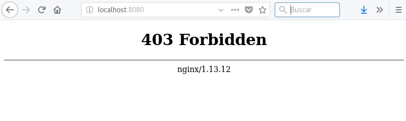
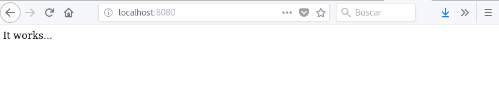

# Solicitud de almacenamiento en Kubernetes: PersistentVolumenCliams

A continuación si nuestro pod necesita un volumen, necesitamos hacer una solicitud de almacenamiento usando un obketo del tipo *PersistentVolumenCliams*.

Cuando creamos un *PersistentVolumenCliams*, se asignará un *PersistentVolumen* que se ajuste a la petición. Está asignación se puede configurar de dos maneras distintas:

* **Estática**: Primero se crea todos los *PersistentVolumenCliams* por parte del administrador, que se irán asignando conforme se vayan creando los *PersistentVolumen*.
* **Dinámica**: En este caso necesitamos un "provisionador" de almacenamiento (para cada uno de los backend), de tal manera que cada vez que se cree un *PersistentVolumen*, se creará bajo demanda un *PersistentVolumenCliams* que se ajuste a las características seleccionadas.

## Creación de *PersistentVolumenClaim*

Siguiendo con el ejercicio anterior vamos a crear una solicitud de almacenamiento del volumen creado anteriormente con NFS. Definimos el objeto en el fichero [`nfs-pvc.yaml`](https://github.com/josedom24/kubernetes/blob/master/ejemplos/volumen/nfs-pvc.yaml):

    apiVersion: v1
    kind: PersistentVolumeClaim
    metadata:
      name: nfs-pvc
    spec:
      accessModes:
        - ReadWriteMany
      resources:
        requests:
          storage: 1Gi

Creamos el recurso y obtenemos los recursos que tenemos a nuestra disposición:

    kubectl create -f nfs-pvc.yaml
    persistentvolumeclaim "nfs-pvc" created
    
    kubectl get pv,pvc
    NAME                      CAPACITY   ACCESS MODES   RECLAIM POLICY   STATUS    CLAIM             STORAGECLASS   REASON    AGE
    persistentvolume/nfs-pv   5Gi        RWX            Recycle          Bound     default/nfs-pvc                            14m

    NAME                            STATUS    VOLUME    CAPACITY   ACCESS MODES   STORAGECLASS   AGE
    persistentvolumeclaim/nfs-pvc   Bound     nfs-pv    5Gi        RWX                           15s

Como podemos observar al crear el *pvc* se busca del conjunto de *pv* uno que cumpla sus requerimientos, y se asocian (*status bound*) por lo tanto el tamaño indicado en el *pvc* es el valor mínimo de tamaño que se necesita, pero el tamaño real será el mismo que el del *pv* asociado.

Si queremos añadir un volumen a un pod a partir de esta solicitud, podemos usar la definición del fichero [`pod-nginx-pvc`](https://github.com/josedom24/kubernetes/blob/master/ejemplos/volumen/pod-nginx-pvc.yaml):

    apiVersion: v1
    kind: Pod
    metadata:
      name: www-vol
    spec:
      containers:
      - name: nginx
        image: nginx
        volumeMounts:
          - mountPath: /usr/share/nginx/html
            name: nfs-vol
      volumes:
        - name: nfs-vol
          persistentVolumeClaim:
            claimName: nfs-pvc

Lo creamos y accedemos a él:

    kubectl create -f pod-nginx-pvc.yaml
    pod "www-vol" created
    
    kubectl port-forward www-vol 8080:80
    Forwarding from 127.0.0.1:8080 -> 80
    Forwarding from [::1]:8080 -> 80

Evidentemente al montar el directorio *DocumentRoot* del servidor (`/usr/share/nginx/html`) en el volumen NFS no tiene `index.html`, podemos crear uno en el directorio compartido del master y estará disponible en todos los nodos:

    echo "It works..." | ssh debian@172.22.201.15 'cat >> /var/shared/index.html'
 
    kubectl port-forward www-vol 8080:80
    Forwarding from 127.0.0.1:8080 -> 80
    Forwarding from [::1]:8080 -> 80

Si escalamos el pod no tendríamos ningún problema ya que todos los nodos del cluster comparten el mismo directorio referenciado por el volumen. Además el contenido del volumen es persistente, y aunque eliminemos el pod, la información no se pierde:

    kubectl delete pod www-vol
    pod "www-vol" deleted

    kubectl create -f pod-nginx-pvc.yaml
    pod "www-vol" created
    
    kubectl port-forward www-vol 8080:80
    Frwarding from 127.0.0.1:8080 -> 80
    Forwarding from [::1]:8080 -> 80

Y desde otro terminal:

    curl http://localhost:8080
    It works...

