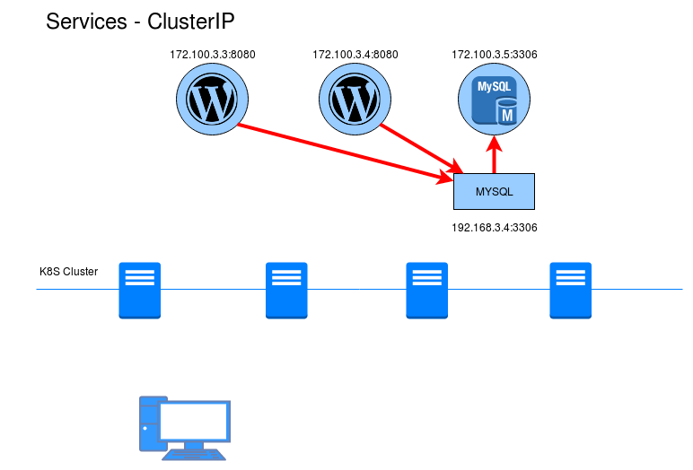
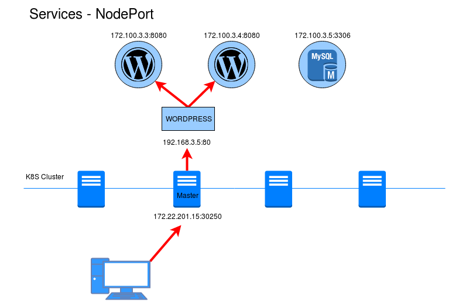
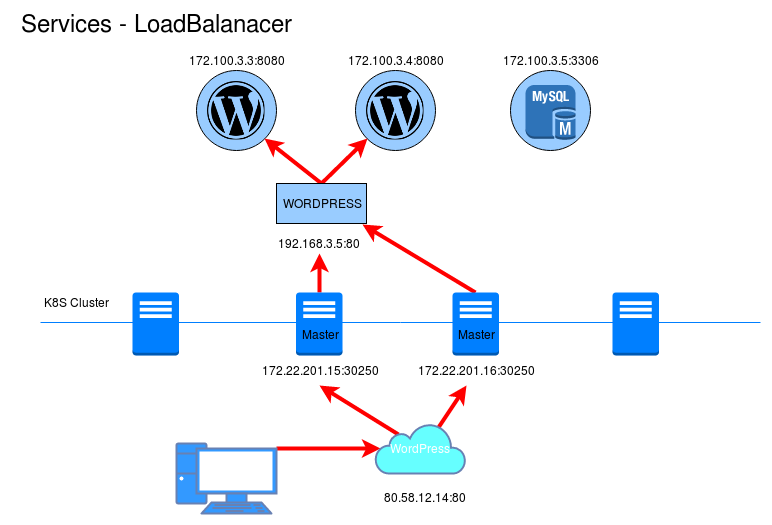

# Recursos de Kubernetes: Services

Los servicios ([`services`](https://kubernetes.io/docs/concepts/services-networking/service/)) nos permiten acceder a nuestra aplicaciones.

* Un servicio es una abstracción que define un conjunto de pods que implementan un micro-servicio. (Por ejemplo el *servicio frontend*).
* Ofrecen una dirección virtual (CLUSTER-IP) y un nombre que identifica al conjunto de pods que representa, al cual nos podemos conectar.
* La conexión al servicio se puede realizar desde otros pods o desde el exterior (mediante la generación aleatoria de un puerto).

Los servicios se implementan con *iptables*. El componente *kube-proxy* de Kubernetes se comunica con el servidor de API para comprobar si se han creado nuevos servicios. 

Cuando se crea un nuevo servicio, se le asigna una nueva ip interna virtual (IP-CLUSTER) que permite conexiones desde otros pods. Además podemos habiliar el acceso desde el exterior, se abre un puerto aleatorio que permite que accediendo a la IP del cluster y a ese puerto se acceda al conjunto de pods. Si tenemos más de un pod el acceso se hará siguiendo una política *round-robin*.

## Tipos de servicios

* **ClusterIP**: Solo permite el acceso interno entre distintos servicios. Es el tipo por defecto. Podemos acceder desde el exterior con la instrucción `kubectl proxy`, puede de ser gran ayuda para los desarrolladores.

* **NodePort**: Abre un puerto, para que el servicio sea accesible desde el exterior. Por defecto el puerto generado está en el rango de 30000:40000. Para acceder usamos la ip del servidor master del cluster y el puerto asignado.

* **LoadBalancer**: Este tipo sólo esta soportado en servicios de cloud público (GKE, AKS o AWS). El proveedor asignara un recurso de balanceo ed carga para el acceso a los servicios. si usamos un cloud privado, como OpenSatck necesitaremos un plugin para configurar el funcionamiento.

## Creación de un recurso services

Para crear un servicio, podemos utilizar la definción del recurso en un fichero yaml, por ejemplo tenemos el fichero [`nginx-srv.yam`](../ejemplos/nginx/nginx-srv.yaml):

    apiVersion: v1
    kind: Service
    metadata:
      name: nginx
      namespace: default
    spec:
      type: ClusterIP
      ports:
      - name: http
        port: 80
        targetPort: http
      selector:
        app: nginx

En este caso vamos a crear un servicio del tipo *ClusterIP*. Con el parámetro `selector` hemos seleccionado los pods a los que vamos a ofrecer acceso. Por último definimos el puerto que va exponer el servicio.

    kubectl create -f ../ejemplos/nginx/nginx-srv.yaml 
    service "nginx" created

También podríamos haber creado el servicio sin usar el fichero yaml, de la siguiente manera:

    kubectl expose deployment/nginx --port=80 --type=ClusterIP

Podemos ver el servicio que hemos creado:

    kubectl get svc
    NAME         TYPE        CLUSTER-IP    EXTERNAL-IP   PORT(S)   AGE
    kubernetes   ClusterIP   10.96.0.1     <none>        443/TCP   3d
    nginx        ClusterIP   10.99.21.74   <none>        80/TCP    10s

Como vemos también tenemos un servicio llamado `kubernetes` que nos ofrece acceso interno al cluster.

## Acceso al servicio

Como hemos comentado con un servicio del tipo *ClusterIP* no podemos acceder desde el exterior. Cualquier pod si podría acceder a ese servicio. 

Sin embargo, puede ser bueno acceder desde exterior, por ejemplo en la fase de desarrollo de una aplicación para probarla. Para realizar el acceso vamos acrear un proxy al cluster de Kubernetes para poder acceder directamente a la API, para ello:

    kubectl proxy

http://localhost:8001/api/v1/namespaces/default/services/nginx:/proxy