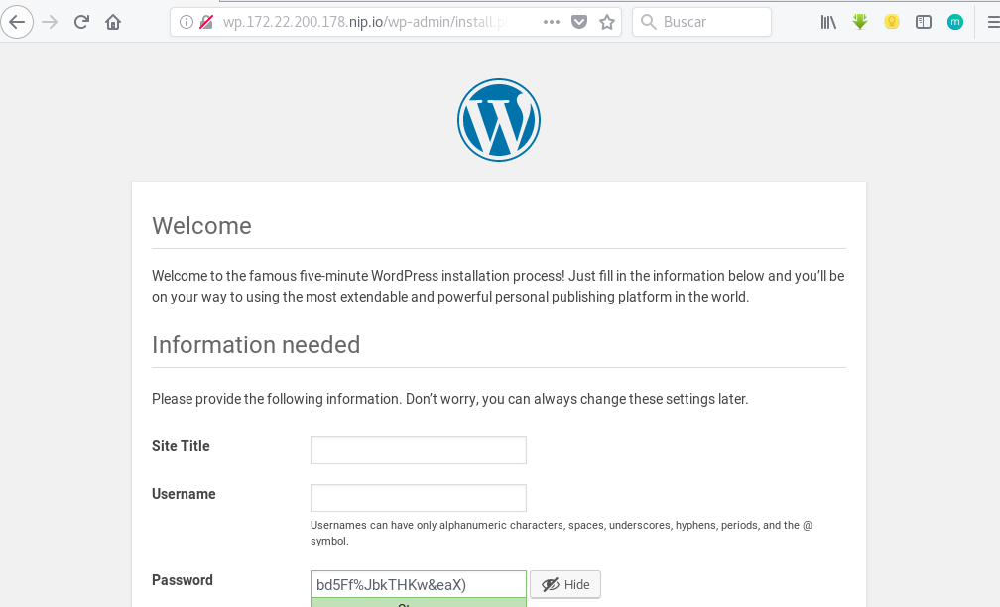

# Ejemplo: Desplegando WordPress con MariaDB

Puedes encontrar todos los ficheros con los que vamos a trabajar en el directorio [`wordpress`](https://github.com/josedom24/kubernetes/tree/master/ejemplos/wordpress).

Vamos a trabajar en un `namespace` lamado *wordpress*:

    kubectl create -f wordpress-ns.yaml 
    namespace "wordpress" created

## Desplegando la base de datos MariaDB

A continuación vamos a crear los `secrets` necesarios para la configuración de la base de datos, vamos a guardarlo en el fichero `mariadb-secret.yaml`:

    kubectl create secret generic mariadb-secret --namespace=wordpress \
                                --from-literal=dbuser=user_wordpress \
                                --from-literal=dbname=wordpress \
                                --from-literal=dbpassword=password1234 \
                                --from-literal=dbrootpassword=root1234 \
                                -o yaml --dry-run > mariadb-secret.yaml

    kubectl create -f mariadb-secret.yaml 
    secret "mariadb-secret" created

Creamos el servicio, que será de tipo *ClusterIP*:

    kubectl create -f mariadb-srv.yaml 
    service "mariadb-service" created

Y desplegamos la aplicación:

    kubectl create -f mariadb-deployment.yaml 
    deployment.apps "mariadb-deployment" created

Comprobamos los recursos que hemos creado hasta ahora:

    kubectl get deploy,service,pods -n wordpress
    NAME                                       DESIRED   CURRENT   UP-TO-DATE   AVAILABLE   AGE
    deployment.extensions/mariadb-deployment   1         1         1            1           20s

    NAME                      TYPE        CLUSTER-IP    EXTERNAL-IP   PORT(S)    AGE
    service/mariadb-service   ClusterIP   10.98.24.76   <none>        3306/TCP   20s

    NAME                                     READY     STATUS    RESTARTS   AGE
    pod/mariadb-deployment-844c98579-cgp84   1/1       Running   0          20s

## Desplegando la aplicación Wordpress

Lo primero creamos el servicio:

    kubectl create -f wordpress-srv.yaml 
    service "wordpress-service" created

Y realizamos el despliegue:

    kubectl create -f wordpress-deployment.yaml 

Y vemos los recursos creados:

    kubectl get deploy,service,pods -n wordpress
    NAME                                         DESIRED   CURRENT   UP-TO-DATE   AVAILABLE   AGE
    deployment.extensions/mariadb-deployment     1         1         1            1           6m
    deployment.extensions/wordpress-deployment   1         1         1            1           25s

    NAME                        TYPE        CLUSTER-IP       EXTERNAL-IP   PORT(S)                      AGE
    service/mariadb-service     ClusterIP   10.98.24.76      <none>        3306/TCP                     6m
    service/wordpress-service   NodePort    10.111.158.165   <none>        80:30331/TCP,443:30015/TCP   25s

    NAME                                        READY     STATUS    RESTARTS   AGE
    pod/mariadb-deployment-844c98579-cgp84      1/1       Running   0          6m
    pod/wordpress-deployment-866b7d9fd8-wf5t4   1/1       Running   0          25s

Por último creamos el recurso `ingress` que nos va a permitir el acceso a la aplicación utilizando un nombre:

    kubectl create -f wordpress-ingress.yaml 
    ingress.extensions "wordpress-ingress" created

    kubectl get ingress -n wordpress
    NAME                HOSTS                      ADDRESS   PORTS     AGE
    wordpress-ingress   wp.172.22.200.178.nip.io             80        20s

Y accedemos:

## Problemas que nos encontramos

En realidad no son problemas, son la consecuencia de que los **pods son efimeros**, cuando se elimina un pod su información se pierde. Por lo tanto nos podemos encontrar con algunas circunstancias:

1. ¿Qué pasa si eliminamos el despliegue de mariadb?, o, ¿se elimina el pod de mariadb y se crea uno nuevo?. En estas circunstancias **se pierde la información de la base de datos** y el proceso de instalación comenzará de nuevo.
2. ¿Qué pasa si escalamos el despliegue de la base de datos y tenemos dos pods ofreciendo la base de datos?. En cada acceso a la aplicación se va a balancear la consulta a la base de datos entre los dos pods (**uno que tiene la información de la instalación y otro que que no tiene información**), por lo que en los accesos consecutivos nos va a ir mostrando la aplicación y en el siguiente acceso nos va a decir que hay que instalar el wordpress.
3. Si escribimos un post en el wordpress y subimos una imagen, ese fichero se va a guardar en el pod que está corriendo la aplicación, por lo tanto si se borra, **se perderá el contenido estático**.
4. En el caso que tengamos un pods con contenido estático (por ejemplo imágenes) y escalamos el despliegue de wordpress a dos pods, **en uno se encontrará la imagen pero en el otro no**, por lo tanto en los distintos accesos consecutivos que se hagan a la aplicación se ira mostrando o no la imagen según el pod que este respondiendo.