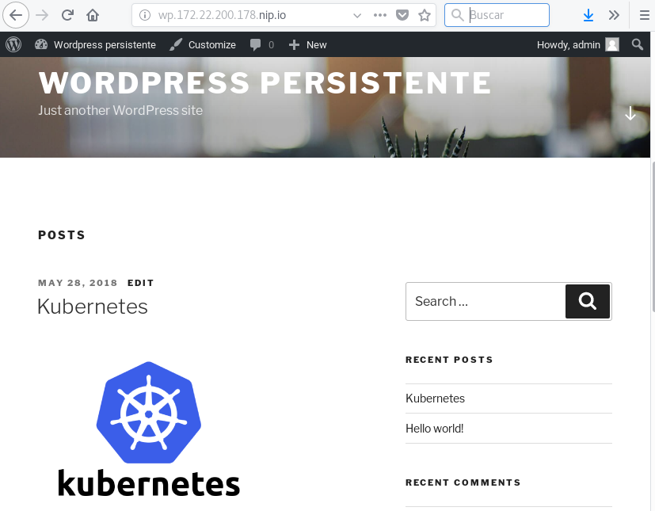

# Ejemplo: Desplegando WordPress con MariaDB con almacenamiento persistente

Puedes encontrar todos los ficheros con los que vamos a trabajar en el directorio [`wordpress2`](https://github.com/josedom24/kubernetes/tree/master/ejemplos/wordpress2).

## Configuración del servidor NFS

Para este ejercicio hemos creado dos directorio que hemos exportado en el servidor NFS, en el fichero `/etc/exports` encontramos:

    /var/shared/vol1 10.0.0.0/24(rw,sync,no_root_squash,no_all_squash)
    /var/shared/vol2 10.0.0.0/24(rw,sync,no_root_squash,no_all_squash)

Y en los clientes montamos dichos directorios:

    mount -t nfs4 10.0.0.4:/var/shared/vol1 /var/data/vol1
    mount -t nfs4 10.0.0.4:/var/shared/vol2 /var/data/vol2

## Gestión del almacenamiento para nuestro despliegue

Lo primero que hacemos es crear los dos *pv* que podemos encontrar definidos en el fichero [`wordpress-pv.yaml`](https://github.com/josedom24/kubernetes/tree/master/ejemplos/wordpress2/wordpress-pv.yaml):

    apiVersion: v1
    kind: PersistentVolume
    metadata:
      name: volumen1
    spec:
      capacity:
        storage: 5Gi
      accessModes:
        - ReadWriteMany
      persistentVolumeReclaimPolicy: Recycle
      nfs:
        path: /var/shared/vol1
        server: 10.0.0.4
    ---
    apiVersion: v1
    kind: PersistentVolume
    metadata:
      name: volumen2
    spec:
      capacity:
        storage: 5Gi
      accessModes:
        - ReadWriteMany
      persistentVolumeReclaimPolicy: Recycle
      nfs:
        path: /var/shared/vol2
        server: 10.0.0.4

Lo creamos:

    kubectl create -f wordpress-pv.yaml
    persistentvolume "volumen1" created
    persistentvolume "volumen2" created

A continuación vamos a trabajar con un *namespace*, por lo tanto lo creamos:

    kubectl create -f wordpress-ns.yaml 
    namespace "wordpress" created

Vamos arealizar la solicitud de almacenamiento para la base de datos, que tenemos definido en el fichero [`mariadb-pvc.yaml`](https://github.com/josedom24/kubernetes/tree/master/ejemplos/wordpress2/mariadb-pvc.yaml):

    apiVersion: v1
    kind: PersistentVolumeClaim
    metadata:
      name: mariadb-pvc
      namespace: wordpress
    spec:
      accessModes:
        - ReadWriteMany
      resources:
        requests:
          storage: 5Gi

De forma similar solicitamos el almacenamiento para nuestra aplicación. Esta solicitud la tenemos definida en el fichero [`wordpress-pvc.yaml`](https://github.com/josedom24/kubernetes/tree/master/ejemplos/wordpress2/wordpress-pvc.yaml).

Creamos las solicitudes:

    kubectl create -f wordpress-pvc.yaml 
    persistentvolumeclaim "wordpress-pvc" created
    
    kubectl create -f mariadb-pvc.yaml  
    persistentvolumeclaim "mariadb-pvc" created

Y lo comprobamos:

    kubectl get pv,pvc -n wordpress     
    NAME                        CAPACITY   ACCESS MODES   RECLAIM POLICY   STATUS    CLAIM                     STORAGECLASS   REASON    AGE
    persistentvolume/volumen1   5Gi        RWX            Recycle          Bound     wordpress/wordpress-pvc                            50s
    persistentvolume/volumen2   5Gi        RWX            Recycle          Bound     wordpress/mariadb-pvc                              49s

    NAME                                  STATUS    VOLUME     CAPACITY   ACCESS MODES   STORAGECLASS   AGE
    persistentvolumeclaim/mariadb-pvc     Bound     volumen2   5Gi        RWX                           10s
    persistentvolumeclaim/wordpress-pvc   Bound     volumen1   5Gi        RWX                           23s

## Desplegando nuestra aplicación

El proceso a partir de aquí es muy parecido al ejercicio anterior, a excepción de que tenemos que modificar los *deployments* para indicar los volumenes de los pods: el fichero [`mariadb-depoyment.yaml`](https://github.com/josedom24/kubernetes/tree/master/ejemplos/wordpress2/mariadb-deployment.yaml) y el fichero [`wordpress-depoyment.yaml`](https://github.com/josedom24/kubernetes/tree/master/ejemplos/wordpress2/wordpress-deployment.yaml).

Y creamos los distintos recursos:

    kubectl create -f mariadb-srv.yaml 
    service "mariadb-service" created

    kubectl create -f wordpress-srv.yaml 
    service "wordpress-service" created

    kubectl create -f wordpress-ingress.yaml 
    ingress.extensions "wordpress-ingress" created

    kubectl create -f mariadb-secret.yaml 
    secret "mariadb-secret" created

    kubectl create -f mariadb-deployment.yaml
    deployment.apps "mariadb-deployment" created

    kubectl create -f wordpress-deployment.yaml
    deployment.apps "wordpress-deployment" created

Y comprobamos todos los recursos creados:

    kubectl get pvc,services,deploy,ingress -n wordpress
    NAME                                  STATUS    VOLUME     CAPACITY   ACCESS MODES   STORAGECLASS   AGE
    persistentvolumeclaim/mariadb-pvc     Bound     volumen2   5Gi        RWX                           22s
    persistentvolumeclaim/wordpress-pvc   Bound     volumen1   5Gi        RWX                           23s

    NAME                        TYPE        CLUSTER-IP       EXTERNAL-IP   PORT(S)                      AGE
    service/mariadb-service     ClusterIP   10.103.198.179   <none>        3306/TCP                     21s
    service/wordpress-service   NodePort    10.105.13.172    <none>        80:32084/TCP,443:31262/TCP   21s

    NAME                                         DESIRED   CURRENT   UP-TO-DATE   AVAILABLE   AGE
    deployment.extensions/mariadb-deployment     1         1         1            1           20s
    deployment.extensions/wordpress-deployment   1         1         1            1           20s

    NAME                                   HOSTS                      ADDRESS   PORTS     AGE
    ingress.extensions/wordpress-ingress   wp.172.22.200.178.nip.io             80        21s

Ya podemos acceder al wordpress, incializarlo, entrar en la administración y crear el primer post:

## Conclusiones

En este ejercicio hemos conseguido que nuestros **pods no sean efímeros**, por lo tanto:

1. ¿Qué pasa si eliminamos el despliegue de mariadb?, o, ¿se elimina el pod de mariadb y se crea uno nuevo?. En nuestro nuevo escenario, **no se perdería la información de la base de datos**, ya que está guardad en un volumen compartido por todos los nodos.
2. ¿Qué pasa si escalamos el despliegue de la base de datos y tenemos dos pods ofreciendo la base de datos?. En cada acceso a la aplicación se va a balancear la consulta a la base de datos entre los dos pods, y en nuestro escenario puede provocar que **se corrompa la información de la base de datos** al escribir y leer al mismo tiempo, una posible solución sería usar un cluster de mysql con [galera](http://galeracluster.com/products/).
3. Si escribimos un post en el wordpress y subimos una imagen, ese fichero se va a guardar en el volumen compartido por todos los nodos, por lo tanto si se borra, **no se perderá el contenido estático**.
4. En el caso que tengamos un pods con contenido estático (por ejemplo imágenes) y escalamos el despliegue de wordpress a dos pods, **los dos pods tienen el contenido estático**, ya que comparten información en el columen compartido.

